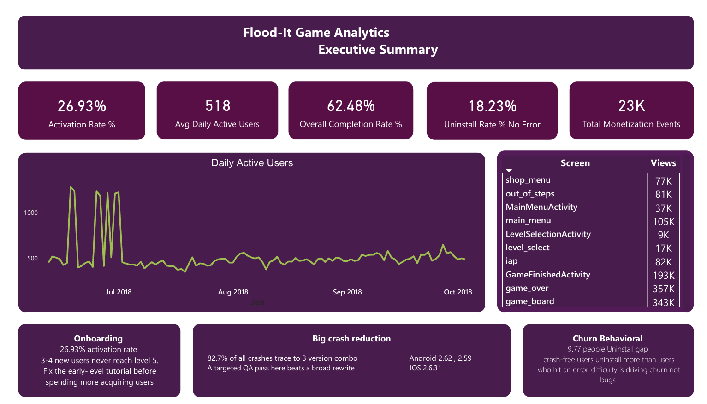
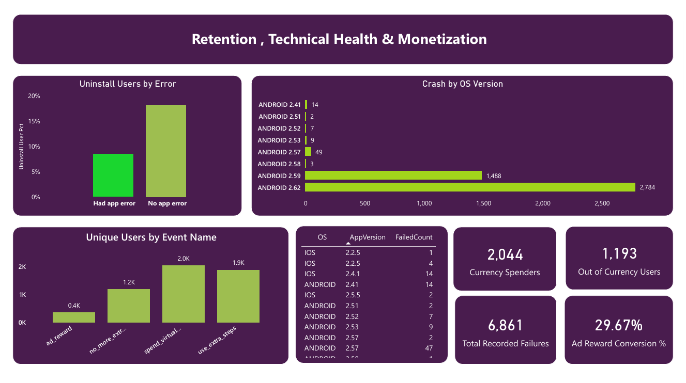
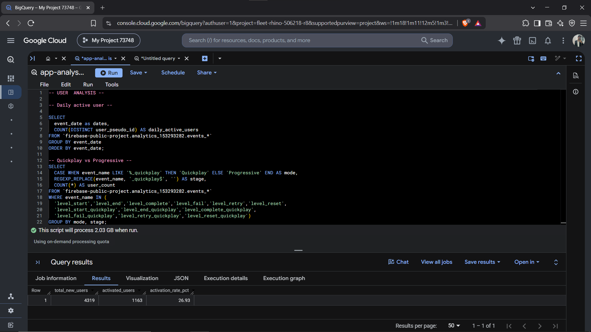

# Flood-It Game Analytics — SQL + Power BI Dashboard

**An end-to-end analytics project using real Google Firebase event data — from raw BigQuery event logs to an executive-ready Power BI dashboard.**

## 📌 Project Summary

Flood-It is a real mobile puzzle game Google publishes as a public Firebase Analytics demo. This project treats it like a live product: I pulled 114 days of its actual (obfuscated) event data from Google BigQuery, cleaned and aggregated it with SQL, modeled it in Power BI, and built a 3-page dashboard to answer real product questions around **growth, engagement, funnel health, and app stability**.

No synthetic data. No pre-cleaned Kaggle CSV. Raw nested event logs, queried straight from a production-style analytics warehouse.

## 🛠️ Tools Used

 Tools  Purpose 

**Google BigQuery**  Source warehouse — queried `firebase-public-project.analytics_153293282.events_*`, a real 5.7M-row, 114-day event export 
**SQL**  All extraction, cleaning, and aggregation (window functions, UNNEST on nested event params, CTEs, conditional aggregation) 
**Power BI** Data modeling and dashboard build 
**DAX** KPI logic — ratios, gap measures, % of total, conversion rates 

## Screenshots
💹 
💹 
💹 
📄 

## ❓ Problem statement 

1. Are new users actually onboarding successfully, or dropping off early?
2. Is daily engagement growing, shrinking, or flat?
3. Which game mode (Quickplay vs. Progressive) retains players better?
4. Does app instability (crashes) actually drive uninstalls — or is something else going on?
5. Which OS/app versions need urgent QA attention?
6. With no real purchase data available, what's the closest proxy for monetization behavior?

## 🔑 Key Findings

- **Onboarding, not acquisition, is the growth bottleneck.** Only **26.93%** of new users ever reach level 5.
- **The churn paradox.** Users who *never* hit an app error uninstall at a *higher* rate (18.23%) than users who did hit one (8.49%) — a **+9.7pp gap** that runs counter to the obvious assumption. Churn here looks behavioral (difficulty/boredom), not technical.
- **Crash fixes have an 80/20 shape.** Just **3 version combos** (Android 2.62, Android 2.59, iOS 2.6.31) account for **82.7%** of every crash logged — a small, targeted QA fix would resolve most of the problem.
- **Progressive mode retains better than Quickplay** (76.6% vs. 55.8% completion rate), despite Quickplay generating ~7x more raw play volume.
- **No monetization data exists in this dataset** — confirmed by querying all 32 distinct event types and finding zero `in_app_purchase` events. Rather than force a "sales" narrative, the project scope was explicitly reframed around engagement and retention, with virtual-economy behavior (ad views vs. in-game currency spend) used as the closest monetization proxy.

## 📊 Dashboard Pages

1. **Executive Summary** — headline KPIs, DAU trend, 3 key-takeaway insight cards
2. **Engagement & Gameplay** — level funnel by mode, screen engagement, virtual economy behavior
3. **Retention & Monetization** — churn/crash analysis, top failure sources, monetization-proxy conversion rate

🔗 [Dashboard link](C:\Users\Admin\Desktop\apps analysis\AppAnalysis.pbip)
 
## 🧹 Data Quality Notes (the part most portfolios skip)

Real analytics work isn't just clean charts — a few things had to be caught and fixed along the way:
- A stray auto-detected relationship between unrelated tables in Power BI's data model caused ratio measures to inflate into six-figure nonsense values — traced and fixed by removing it.
- A numeric column silently imported as Text, causing `SUM()`/`DIVIDE()` to return blank — caught by isolating the measure in a single card visual.
- The first version of the level-completion rate used raw event counts instead of distinct users, wildly overstating "attempts" — rebuilt the SQL to count `DISTINCT user_pseudo_id` instead, which is the version reflected in the findings above.

## 🗂️ Data Source

Google's public Firebase Analytics sample export for **Flood-It!**, a real puzzle game published by Google/AdMob for demonstration purposes:
`firebase-public-project.analytics_153293282.events_*` (BigQuery, free public dataset, no billing account required)

🔗 [Bigquery link] (https://console.cloud.google.com/bigquery?ws=!1m7!1m6!12m5!1m3!1sfleet-rhino-506218-r8!2sus-central1!3s841bf03d-2009-4e44-9ae7-6985f1d631b9!2e1)
📰[File](C:\Users\Admin\Desktop\apps analysis\app analysis.sql)

## 🚀 How to Reproduce

1. Query BigQuery using the SQL in `/sql` (extraction + aggregation queries, one per KPI)
2. Import each query's output into Power BI (BigQuery native connector or CSV)
3. Set data types (`Whole Number` for counts, `Date` for the DAU date column)
4. Apply the DAX measures documented in the build blueprint
5. No relationships needed between tables — each is a pre-aggregated, independent summary table

## 🙌 Feedback Welcome
Thank you for exploring my sales Analysis project!
I’m always open to suggestions, improvements, or collaboration ideas.

📩 Feel free to connect with me on LinkedIn

📧 Or drop an email: abdulrahman082004@gmail.com

Your feedback helps me grow and build better data-driven solutions. Let’s connect and discuss ideas!#